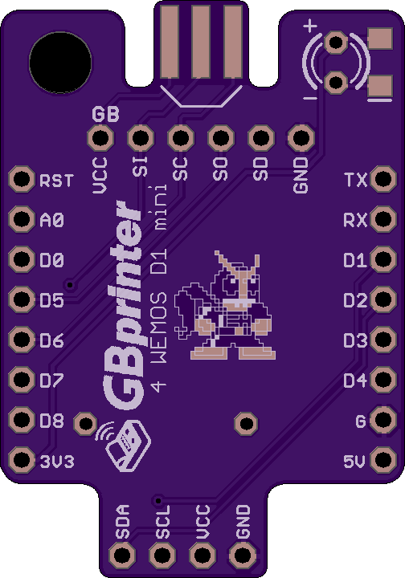

# Game Boy WiFi Printer - WEMOS D1 Mini Shield

Enthusiasts on the [Game Boy Camera Club discord server](http://bit.ly/gbccd) have been working on a Game Boy Printer emulator project based on ESP8266 D1 mini boards. Taking inspiration from other projects like the [Gameboy Link Cable Breakout PCB](https://github.com/Palmr/gb-link-cable), I created this shield board to add a link connector and pinouts for an oled screen.

The board is redesigned to a nearly size of a WEMOS D1 mini. There's a pinout for an OLED from the original board but OLED shield could be used (test needed).

Here's a render of the PCB (OSH-Park):

You can get help with the original project and find info on the software that runs on the ESP by joining the [Game Boy Camera Club discord server](http://bit.ly/gbccd)
